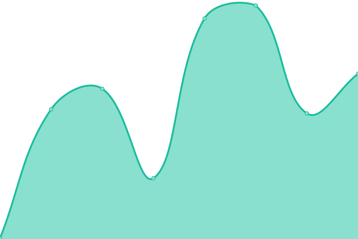
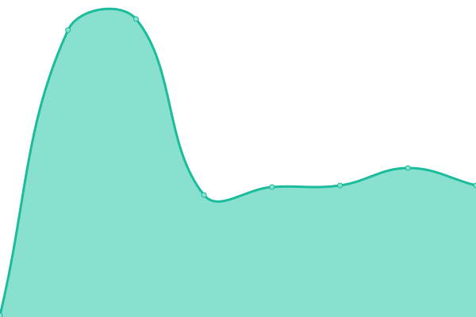

# [📈 Live Status](https://demo.upptime.js.org): <!--live status--> **🟩 All systems operational**

This repository contains the open-source uptime monitor and status page for [Pirani](https://demo.upptime.js.org), powered by [Upptime](https://github.com/upptime/upptime).

With [Upptime](https://upptime.js.org), you can get your own unlimited and free uptime monitor and status page, powered entirely by a GitHub repository. We use [Issues](https://github.com/Pirani/upptime/issues) as incident reports, [Actions](https://github.com/Pirani/upptime/actions) as uptime monitors, and [Pages](https://demo.upptime.js.org) for the status page.

<!--start: status pages-->
<!-- This summary is generated by Upptime (https://github.com/upptime/upptime) -->
<!-- Do not edit this manually, your changes will be overwritten -->
<!-- prettier-ignore -->
| URL | Status | History | Response Time | Uptime |
| --- | ------ | ------- | ------------- | ------ |
|  [Pirani Freemium - Service organizations - QA](https://cert.pirani.co/services/organizations/actuator/health) | 🟩 Up | [pirani-freemium-service-organizations-qa.yml](https://github.com/cero-pirani/Pirani-status-upptime/commits/HEAD/history/pirani-freemium-service-organizations-qa.yml) | 

 158ms
     
 | 

<a href="https://cero-pirani.github.io/Pirani-status-upptime/history/pirani-freemium-service-organizations-qa">99.84%</a>
    

|  [Pirani Freemium - Service organizations](https://platform.pirani.co/services/organizations/actuator/health) | 🟩 Up | [pirani-freemium-service-organizations.yml](https://github.com/cero-pirani/Pirani-status-upptime/commits/HEAD/history/pirani-freemium-service-organizations.yml) | 

 140ms
     
 | 

<a href="https://cero-pirani.github.io/Pirani-status-upptime/history/pirani-freemium-service-organizations">100.00%</a>
    

|  [Pirani Freemium - WEBSITE](https://www.piranirisk.com) | 🟩 Up | [pirani-freemium-website.yml](https://github.com/cero-pirani/Pirani-status-upptime/commits/HEAD/history/pirani-freemium-website.yml) | 

 1214ms
     
 | 

<a href="https://cero-pirani.github.io/Pirani-status-upptime/history/pirani-freemium-website">100.00%</a>
    

|  [Google](https://www.google.com) | 🟩 Up | [google.yml](https://github.com/cero-pirani/Pirani-status-upptime/commits/HEAD/history/google.yml) | 

 88ms
     
 | 

<a href="https://cero-pirani.github.io/Pirani-status-upptime/history/google">100.00%</a>
    

<!--end: status pages-->

[**Visit our status website →**](https://demo.upptime.js.org)

## 📄 License

- Powered by: [Upptime](https://github.com/upptime/upptime)
- Code: [MIT](./LICENSE) © [Pirani](https://demo.upptime.js.org)
- Data in the `./history` directory: [Open Database License](https://opendatacommons.org/licenses/odbl/1-0/)
